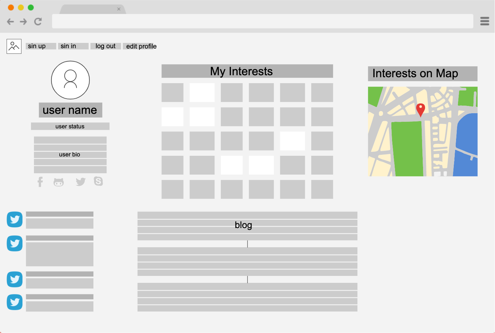
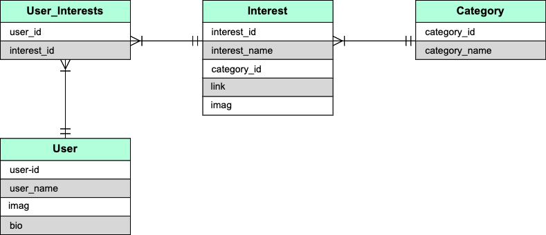

# README

This README would normally document whatever steps are necessary to get the
application up and running.

Things you may want to cover:

* Ruby version

* System dependencies

* Configuration

* Database creation

* Database initialization

* How to run the test suite

* Services (job queues, cache servers, search engines, etc.)

* Deployment instructions

* ...

## User Stories
- [ ] As a user, I should be able to go to Home Page by link, address bar in browser and website logo in all pages
- [ ] As a user, I should be able to click on a Sin Up link to register myself as a new user
- [ ] As a User I must be able to sign in
- [ ] As a User I must be able to change password
- [ ] As a User I must be able to sign out
- [ ] As a User I must be able to create a new Interest
- [ ] As a User I must be able to edit my interests
- [ ] As a User I must be able to view all interests they created
- [ ] As a User I must be able to view a single interest they created
- [ ] As a User I must not be able to edit or delete other users' Interests

## Wire Frame:

## Entity Relations Digram (ERD)

